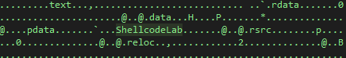
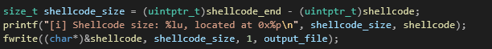
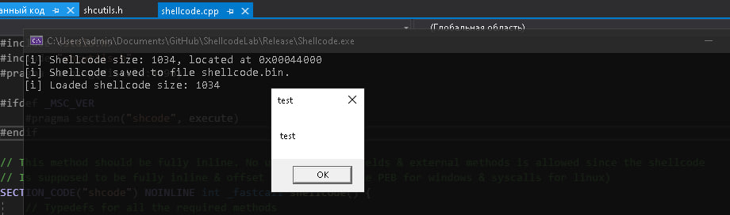
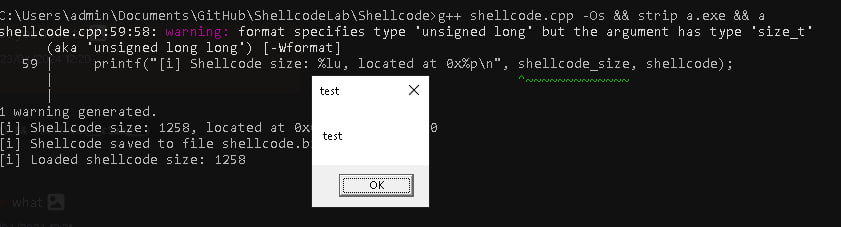
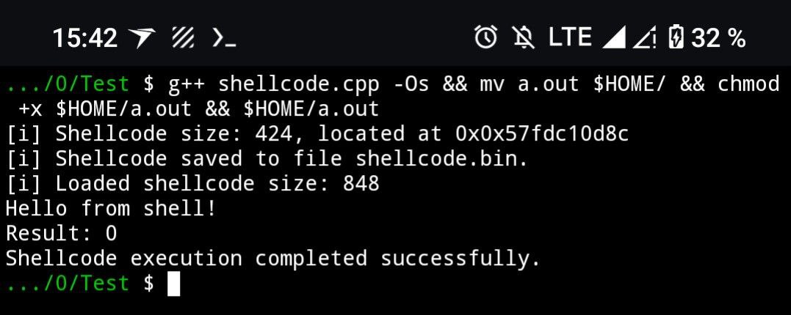

# ShellcodeLab

    </img>

A C/C++ project designed to simplify shellcode creation on any compilers and platforms using C. Supports x86_64, x86_32, ARM & ARM64 arches on clang/g++/visual c++ compilers.

## ℹ️ Overview & theory
A shellcode is an offset-independent assembly code which can be executed from any part of program. Those are commonly used by cyber-security engineers, hackers and lowlevel developers (anticheats, protections, etc). This project presents a way to create shellcodes easily in pure C, without any ASM usage, allowing to write universal shellcodes across architectures/platforms. On windows PEB (Process Environment Block) and TEB (Thread Environment Block) can be used to obtain function addresses without using any externals. On linux you can just use syscalls.

Usually shellcodes are made in pure asm, since forcing the compiler to properly create & extracting shellcodes can be a headache. Yet ShellcodeLab solves this problem.

    </img>
    <text>Two methods are used to mark & dump shellcode from a compiled C method</text>

 

    </img>
    <text>When compiled, the shellcode is placed in a separete section</text>

 

This way the shellcode can be extracted via 2 methods: function address substraction during runtime, or PE/ELF section parsing. I prefer the first one, since it's easier + more universal.

    </img>
    <text>Function address substraction to extract shellcode</text>

## ℹ️ Demonstration

    </img>
    <text>Microsoft Visual C++ compiler</text>

 

    </img>
    <text>Clang (LLVM/MinGW) compiler</text>

 

    </img>
    <text>Clang ARM64 (Android) compiler</text>

